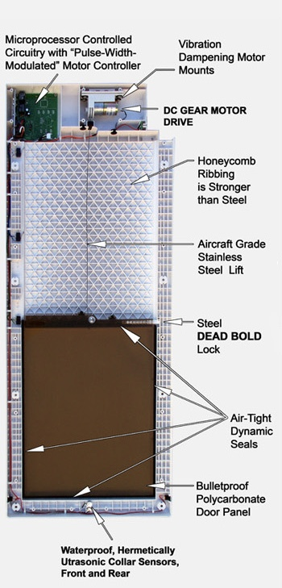

# Lesson: Interaction Design

| First & Last Name |  Uni. Registration Number | GitHub Profiles |   
| :---      |     :---:      |          ---: | 
| Maria-Nikoletta Katsarou  | dpsd19051     | [MaritettaKatsarou](https://github.com/MaritettaKatsarou)   | 
| Artemis Malliakoudi   | dpsd19070    | [ArtemisMalliakoudi](https://github.com/Artem1sM)   | 
| Evaggelos Panagiaris-Maleas    | dpsd19090     | [VaggelisPanagiaris](https://github.com/VaggelisPanagiaris) |   

# Introduction
Έξυπνο πορτάκι για μικρόσωμα κατοικίδια που θα επιτρέπει την ελεγχόμενη είσοδο σε συγκεκριμένα ζώα με βάση το microchip τους. 

# Summary 
Έξυπνο πορτάκι που ενσωματώνεται σε ήδη υπάρχουσες πόρτες για μικρόσωμα κατοικίδια που θα επιτρέπει την ελεγχόμενη είσοδο σε συγκεκριμένα ζώα με βάση το microchip τους.
Θα αποθηκεύει στη μνήμη του μέχρι 5 microchip και θα ξεκλειδώνει το πορτάκι όταν κάποιο απο αυτά βρίσκεται σε απόσταση 30cm.

# 1st Deliverable
## 1. Design Brief
Έξυπνο πορτάκι που ενσωματώνεται σε ήδη υπάρχουσες πόρτες για μικρόσωμα κατοικίδια ώστε να επιτρέπεται η ελεγχόμενη είσοδος – έξοδος σε συγκεκριμένα ζώα με βάση την ηλεκτρονική τους ταυτότητα (μπρελοκ στο λουράκι τους). Ο μηχανισμός, θα αποθηκεύει στη μνήμη του μέχρι 5 ηλεκτρονικές ταυτότητες και θα ξεκλειδώνει το πορτάκι όταν κάποιο από τα κατοικίδια βρίσκεται σε απόσταση 30cm από την πόρτα.
Ο σκοπός είναι η δημιουργία ασφαλούς μηχανισμού επιλεκτικής προσβασιμότητας δεσποζομένων ζώων σε εσωτερικούς χώρους. Επιμέρους στόχοι, είναι τα μικρά ζώα συντροφιάς να μπορούν να μετακινούνται από το εσωτερικό μιας κατοικίας/γραφείου, σε εξωτερικούς χώρους και το αντίστροφο, με ασφάλεια χωρίς την παρέμβαση τρίτου προσώπου, και παράλληλα να εμποδίζεται η είσοδος των αδέσποτων ζώων.

## 2. Research
STP
Προσδοκώμενο όφελος         
1.Διάκριση και έλεγχος κατά την είσοδο και έξοδο των δεσποζόμενων μικρόσωμων κατοικίδιων από τα αδέσποτα
2.Αναβάθμιση της ποιότητας ζωής των μικρόσωμων κατοικίδιων        
3.Διευκόλυνση των ανθρώπων κατά την είσοδο και έξοδο των κατοικίδιων τους
 
Περίσταση χρήσης  
1.       1.Μέσα στην καθημερινότητα        2. Περιστασιακά      3. Εκτάκτως
Συχνότητα χρήσης                     
1.       1.Μεγάλη                          2. Μεσαία                   3. Μικρή       
Πιστότητα                                     
1.       1.Μεγάλη(loyalty)          2. Switcher                 3. Random
Ετοιμότητα    
1.   	1.Μεγάλη                          2.  Μέτρια                    3. Μικρή  
                 
Ψυχογραφικά
Στάση ζωής 
1.   	1.Innovator         2. early adopter        3. late adopter       
Χαρακτήρας      
1.        1.Εσωστρεφής                   2. Εξωστρεφής
 
Δημογραφικά

Ηλικία          
1. 18-26                
2. 27-34                    
3. 35-46                 
4. 47-55           
5. 56-65   
        
Μόρφωση         
1.          1.Πρωτοβάθμια        2. Δευτεροβάθμια    3. Τριτοβάθμια   4.Διδακτορικό
Επίπεδο εισοδήματος        
1.         1.Φοιτητής                 2. Άνεργος                3.  Εργαζόμενος
Τόπος κατοικίας  
1.         1.Αστικές                  2. Αγροτικές
 
 
### Αποτελέσματα STP (προφίλ δυνητικών χρηστών)
*Προφίλ 1*

Διάκριση και έλεγχος κατά την είσοδο και έξοδο των δεσποζόμενων μικρόσωμων κατοικίδιων από τα αδέσποτα          
Μέσα στην καθημερινότητα (περίσταση χρήσης )
Μεγάλη    (συχνότητα χρήσης)
 Loyalty    (πιστότητα)
 Μεγάλη     (ετοιμότητα)
Early adopter  (Στάση ζωής)
Εξωστρεφής  (χαρακτήρας)
18-26, 27-34, 35-46, 47-55, 56-65 (ηλικία)
Δευτεροβάθμια, Τριτοβάθμια   (μόρφωση)
Φοιτητής, εργαζόμενος        (επίπεδο εισοδήματος)
Αστικές            (τόπος κατοικίας)

*Προφίλ 2* 

Αναβάθμιση της ποιότητας ζωής των μικρόσωμων κατοικίδιων  
Μέσα στην καθημερινότητα (περίσταση χρήσης)
Μεγάλη(συχνότητα χρήσης
Loyalty(πιστότητα)
Μέτρια (ετοιμότητα)                   
Innovator  (Στάση ζωής)
Εσωστρεφής (χαρακτήρας)
18-26, 27-34, 35-46, 47-55(ηλικία)                            
Δευτεροβάθμια, Τριτοβάθμια   (μόρφωση)                      
Φοιτητής, Εργαζόμενος(επίπεδο εισοδήματος)                              
Αστικές(τόπος κατοικίας)
 
*Προφίλ 3* 

Διευκόλυνση των ανθρώπων κατα την είσοδο και έξοδο των κατοικίδιων 
Μέσα στην καθημερινότητα(περίσταση χρήσης ) 
Μεγάλη    (συχνότητα χρήσης)
Random(πιστότητα)
Μέτρια   (ετοιμότητα)
Late adopter (Στάση ζωής)
Εσωστρεφής  (χαρακτήρας)
18-26, 35-46, 47-55, 56-65  (ηλικία)
Δευτεροβάθμια, Τριτοβάθμια   (μόρφωση)
Φοιτητής, Εργαζόμενος         (επίπεδο εισοδήματος)
Αγροτικές         (τόπος κατοικίας)
 
## 2.i. Define Activities
Ο χρήστης, χωρίς αυτό το προτεινόμενο τεχνούργημα, έπρεπε κάθε φορά που το μικρόσωμο κατοικίδιό του ήθελε να βγει έξω από το σπίτι ή να μπει σε αυτό, να αναγκάζεται:
·         να βρίσκεται στο σπίτι ώστε να ικανοποιεί την ανάγκη του κατοικιδίου του και
·         να αναγκάζεται ο ίδιος να ανοίγει ή να κλείνει την πόρτα προκειμένου το κατοικίδιο να βγει ή να μπει στο σπίτι.
Η διαδικασία αυτή ήταν ιδιαίτερα δεσμευτική για το χρήστη αλλά και δημιουργούσε κινδύνους για το μικρό του κατοικίδιο, στην περίπτωση που αυτό θα ήθελε να μπει στο σπίτι. Θα το αντιλαμβανόταν εγκαίρως ο χρήστης; Είναι πολύ αμφίβολο. Στην περίπτωση που ο χρήστης άφηνε ανοιχτή την πόρτα ώστε να διευκολυνθεί εκείνος και το κατοικίδιό του, θα εισέρχονταν μέσα στο σπίτι και άλλα αδέσποτα ζώα δημιουργώντας μεγαλύτερο πρόβλημα.
Τέλος, σε περίπτωση φυσικής καταστροφής, (σεισμός, πυρκαγιά, κλπ.), εάν ο ιδιοκτήτης απουσίαζε από το σπίτι, το μικρό κατοικίδιο θα είχε εγκλωβιστεί μέσα.
## 2.ii. Describe Context
Η αφετηρία της συγκεκριμένης τεχνολογικής αναζήτησης, έχει τις ρίζες της στο κίνημα για τα δικαιώματα των ζώων (ή αλλιώς κίνημα απελευθέρωσης των ζώων, κίνημα της ατομικότητας των ζώων, κίνημα της υπεράσπισης των ζώων κλπ.) και υλοποιείται βασιζόμενη στην ανάπτυξη των τεχνολογιών επικοινωνίας, που επιτρέπουν την ασύρματη σύνδεση δύο «συσκευών» από απόσταση, με παράλληλη ενεργοποίηση εφαρμογών αυτοματισμού, που βασίζεται σε ανάπτυξη συγκεκριμένου κώδικα προγραμματισμού.
 
## 2.iii. Review needed Technologies
 
1. Dog GPS Collar Devices
πχ: Whistle GO Explore
Utilizing AT&T’s wireless network and Google Maps, the Whistle GO Explore will notify you whenever your dog leaves his designated safe space and provides live location tracking. In addition to GPS monitoring, the Whistle can also be used to track physical activity goals for your pet, as well as certain health behaviors. Rover testers were able to use the Whistle to find their dogs consistently in urban and suburban environments (including those with buildings, water, trees, and open fields), and they reported almost no calibration delays for dogs on the move.

2. PetSafe Electronic SmartDoor - Collar Activated Dog and Cat Door - Small to Large Pets
[Amazon Link](https://www.amazon.com/PetSafe-Electronic-SmartDoor-Automatic-Activated/dp/B000WJ0IFQ)
 
About this item 
·         CUSTOMIZE YOUR PET’S ACCESS: The SmartDoor features programmable selective entry, exit and auto-locking options 
·         PEACE OF MIND: The SmartDoor works with the waterproof SmartKey worn on your pet's collar; only the pets wearing the SmartKey can go in and out 
·         MULTIPLE PETS: Great for households with multiple pets; programmable for up to 5 SmartKeys 
·         BATTERY OPERATED: The SmartDoor is battery operated (4 D-Cell Batteries, not included) 
·         DOOR INSTALLATION: Designed for installation in interior/exterior doors; wall installation option available with purchase of Wall Install Kit. Caution: Small children can pass through door 
·         EXPERIENCE: PetSafe brand has been an industry leading U.S. manufacturer of pet behavior, containment, and lifestyle products since 1991, helping millions of people and pets each year.
 
3.	Τεχνολογίες  που εφαρμόζονται σε πόρτες

[Petdoors Link](https://www.petdoors.com/collections/electronic-automatic-microchip)
 
[DogDoor Info](https://www.hitecpet.com/electronic-dog-doors.html)

# 2nd Deliverable
## 3. Information Architecture
Το συγκεκριμένο προϊόν, στηρίζεται στην ανάπτυξη μιας τεχνολογίας αναγνώρισης ή επιβεβαίωσης μιας ηλεκτρονικής ταυτότητας που φέρει ένα μικρόσωμο ζώο, και στη διαχείριση αυτής της πληροφορίας από το αντικείμενο, έτσι ώστε να ενεργοποιείται ένα σύστημα αυτοματισμού που θα επιτρέπει την είσοδο ή την έξοδο του ζώου σε, ή από, έναν κλειστό χώρο. Η αρχιτεκτονική δόμησης του παραπάνω συστήματος, ακολουθεί την εξής διαδικασία:

*1.Ανίχνευση δεδομένων:* Το σύστημα εντοπίζει κι ανιχνεύει την ηλεκτρονική ταυτότητα του ζώου, μέσω απομακρυσμένης επαφής τεχνολογίας RFID και συγκεκριμένα NFC.

*2.Ταίριασμα της ταυτότητας του ζώου:* Το σύστημα συγκρίνει τα δεδομένα που λαμβάνει μέσω των αισθητήρων του, με αυτά που είναι αποθηκευμένα στη βάση δεδομένων του, κι επιβεβαιώνει αν συμπίπτουν, δηλ. αν ανήκουν στο ίδιο ζώο. Η ανωτέρω τεχνολογία περιλαμβάνει τις έννοιες της ταυτοποίησης και της αυθεντικοποίησης. Η πρώτη έννοια απαντάει στο ερώτημα «ποιος είσαι;» και αναφέρεται στην ικανότητα του συστήματος να αναγνωρίσει ένα ζώο που φέρει μία ηλεκτρονική ταυτότητα. Η δεύτερη έννοια, απαντάει στο ερώτημα «είσαι όντως αυτός που ισχυρίζεσαι;», με άλλα λόγια η τεχνολογία αναγνώρισης του ζώου που φέρει το σύστημα, καλείται να επιβεβαιώσει ότι η ηλεκτρονική ταυτότητα του μικρού ζώου, είναι πραγματικά αυτή που αναγνωρίζει το σύστημα. Η προτεινόμενη τεχνολογία, θα πρέπει να επιτρέπει στο σύστημα να αναγνωρίζει το ζώο, ανεξαρτήτως των αλλαγών του εξωτερικού περιβάλλοντος, π.χ. φωτισμός, η οπτική γωνία με την οποία κοιτάει το αναγνωριζόμενο ζώο κλπ.

*3.Σύμφωνα με τον οργανωσιακό κώδικα του συστήματος:* απ’ τη στιγμή που το σύστημα αναγνωρίζει συγκεκριμένες πληροφορίες οι οποίες υπάρχουν αποθηκευμένες στη βάση των δεδομένων του, αίρει μηχανικά και για συγκεκριμένο διάστημα, τους περιορισμούς πρόσβασης του μικρόσωμου ζώου στο συγκεκριμένο χώρο.
 
Σχετικές τεχνολογίες αναγνώρισης «προσωπικών δεδομένων», έχουν βρει πολλές εφαρμογές σε πλήθος υπηρεσιών της καθημερινής μας ζωής (Τράπεζες – πρόσβαση σε τραπεζικό λογαριασμό, επιχειρήσεις – είσοδος των εργαζομένων κλπ.), έτσι ώστε να εξασφαλίζεται η ελεγχόμενη πρόσβαση σε φυσικούς ή ψηφιακούς χώρους.
 
Όπως κάθε σύστημα, για να μπορεί να είναι λειτουργικό, έτσι και στο προτεινόμενο, είναι απαραίτητο να εξασφαλίζεται η ενεργειακή αυτονομία του.
 
## 4. User Interaction
Αυτό το σύστημα, αποτελείται από το smartdoor και το smartkey καθώς και τον επεξεργαστή της πληροφορίας που βάση συγκεκριμένου προγραμματισμού, ανταποκρίνεται σε αυτή θετικά ή αρνητικά. Το smartkey τοποθετείται στο κολάρο του κατοικίδιου και εμπεριέχει το microchip του, έτσι ώστε να ανιχνευτεί από το smartdoor, από συγκεκριμένη απόσταση. Το σύστημα εν συνεχεία, επιβεβαιώνει ή διαψεύδει την ταύτιση των δεδομένων του smartkey με αυτά που έχουν αποθηκευτεί στο smartdoor, και εφ’ όσον αναγνωρίζει και πιστοποιεί την αυθεντικότητα του κατοικιδίου, ανταποκρίνεται θετικά και ενεργοποιεί το μηχανισμό που θα επιτρέπει την έξοδο και την είσοδο του κατοικιδίου, για συγκεκριμένο χρονικό διάστημα. Εάν δεν διαπιστωθεί η αυθεντικότητα του κατοικιδίου,  το σύστημα δεν ανταποκρίνεται και η είσοδος παραμένει κλειστή. Ο χρήστης με τη χρήση του συστήματος, δεν χρειάζεται να παρευρίσκεται στο σπίτι κάθε φορά που το μικρόσωμο κατοικίδιό του θελήσει να βγει έξω από το σπίτι ή και το αντίστροφο. Το μόνο που πρέπει να κάνει ο χρήστης, είναι να εφοδιάσει το κάθε μικρό του ζώο με ξεχωριστό κωδικό πρόσβασης στο smartkey, τον οποίον θα τον «περάσει» και στη βάση δεδομένων του smartdoor. Επιπλέον, θα πρέπει να προγραμματίσει το χρόνο που η πόρτα θα παραμένει ανοιχτή, μετά την ταυτοποίηση του ζώου. Το κατοικίδιο που φέρει το smartkey, μόλις πλησιάσει το έξυπνο πορτάκι σε απόσταση 30cm, προκαλεί το άνοιγμα του τελευταίου. Επιπρόσθετα το smartkey διαχωρίζει τα αδέσποτα από τα δεσποζόμενα ζώα, και με αυτό τον τρόπο αποτρέπει την είσοδο αδέσποτων ζώων μέσα στο σπίτι, ενώ ταυτόχρονα επιτρέπει την ελεγχόμενη κυκλοφορία των δεσποζόμενων ζώων. Τέλος, παρέχει τη δυνατότητα καταχώρησης έως 5 microchip.
 
## 5. Interface design
Για να αξιολογηθεί η ευχρηστία μιας ηλεκτρονικής πόρτας μικρόσωμων κατοικίδιων, η πρώτη ερώτηση είναι: "Η πόρτα ανοίγει και κλείνει πραγματικά μόνη της ή απλώς ξεκλειδώνει, απαιτώντας από το κατοικίδιο να την σπρώξει για να ανοίξει;" Οι περισσότερες αποκαλούμενες "ηλεκτρονικές πόρτες κατοικίδιων ζώων" στην αγορά, δεν ανοίγουν με μοτεράκι (μηχανή) και απαιτούν από το κατοικίδιο να ανοίξει σπρώχνοντας το πάνελ. Αυτό είναι κάτι που σε πολλά κατοικίδια δεν αρέσει να κάνουν ή δεν καταλαβαίνουν ότι πρέπει να το κάνουν. Οι μηχανοκίνητες ηλεκτρονικές πόρτες μικρόσωμων ζώων, αποτελούν μια κατηγορία από μόνες τους, με τεράστια πλεονεκτήματα σε σχέση με τις ηλεκτρονικές πόρτες που απλώς ξεκλειδώνουν. Επίσης, οι μηχανοκίνητες πόρτες πέρα από το ότι είναι βολικές για τον χρήστη (ιδιοκτήτη) αλλά και το κατοικίδιό του, είναι και πολύ πιο ασφαλείς. Αυτό οφείλεται στο ότι η γραμμική τροχιά στην οποία το πάνελ κινείται πάνω-κάτω, παρέχει ένα ασφαλές κλείσιμο και έναν ανθεκτικότερο μηχανισμό συγκράτησης που αντιστέκεται σε πιθανές κακόβουλες ενέργειες εισβολέων. Επομένως, αυτή η τεχνολογία είναι η καταλληλότερη για να χρησιμοποιηθεί από την ομάδα μας.

Στην παρακάτω εικόνα φαίνονται τα parts που διαθέτουν αυτές οι μηχανοκίνητες πόρτες. Πάνω αριστερά βλέπουμε τον μικροπροσέσορα (δηλαδή, το arduino στο δικό μας project) ο οποίος εκτός του ότι ανιχνεύει το microchip του ζώου προκειμένου να ανοίξει το πορτάκι, είναι συνδεδεμένος και με το μοτεράκι το οποίο ανοίγει και κλείνει την πόρτα σε εύλογο χρονικό διάστημα.

# 3rd Deliverable 

# Conclusions

# Sources

https://www.instructables.com/Animal-Micro-Chip-Scanner-RFID-Reader-Arduino/

http://arduiniana.org/libraries/newsoftserial/

https://www.instructables.com/RFID-cat-door/

https://github.com/SensorsIot/Animal-RFID-Reader

https://www.youtube.com/watch?v=GOO84CGBPz8

https://www.tinkercad.com/things/5qWB0tzlav7-copy-of-sistema-rfid/editel?tenant=circuits

https://forum.arduino.cc/t/arduino-uno-ethernet-rfid-not-working/419221
